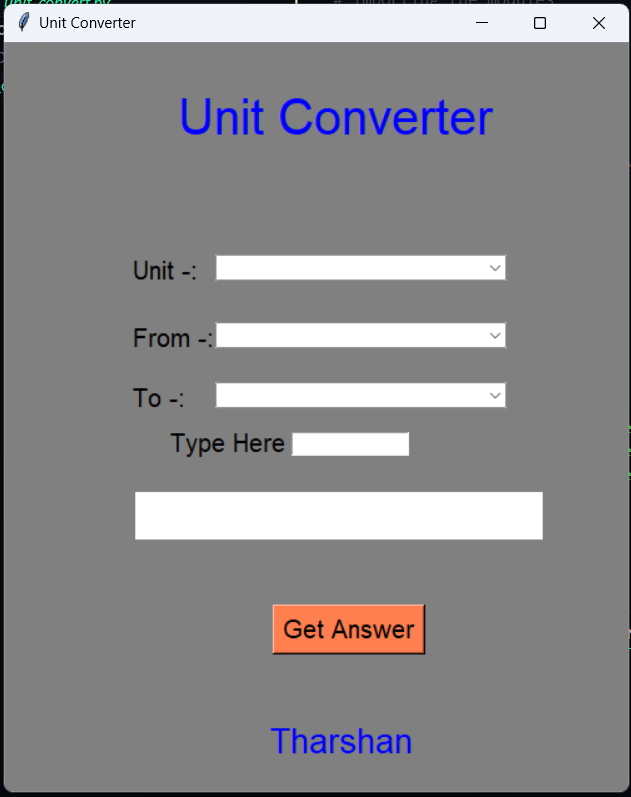

# Unit Converter

A graphical unit conversion tool built with **Python's Tkinter** library. This application allows users to convert between different units of **volume**, **length**, and **mass** with a simple and intuitive interface.

---

##  Features

- Volume unit conversions (e.g., Cubic meters ⇄ Liters)
- Length unit conversions (e.g., Millimeters ⇄ Kilometers)
- Mass unit conversions (e.g., Milligrams ⇄ Kilograms)
- Real-time input and conversion
- Error handling for invalid input
- Easy-to-use dropdown menus for unit selection

---

##  GUI Preview

 <!-- Replace with actual image if available -->

---

## Requirements

- Python 3.x

No external libraries are required as this uses only built-in Python modules.

---

## How to Run

1. Clone or download this repository.
2. Navigate to the folder containing the script.
3. Run the Python file:

```bash
python unit_converter.py


Project Structure 
unit-converter/
│
├── unit_converter.py   # Main GUI application
├── README.md           # Project description
└── preview.png         # (Optional) Screenshot of GUI

Supported Units
    Volume
        Cubic meters
        Cubic foot
        Liters
        Gallons
        Cubic Centimeters

    Length
        Millimeters
        Centimeters
        Decimeters
        Meters
        Kilometers
    Mass
        Milligrams
        Centigrams
        Grams
        Decigrams
        Kilograms

⚠ Notes
    Make sure to input valid numbers before clicking convert.
    If you select mismatched unit types, conversion will not proceed.
    Future updates may include temperature, time, or currency support.

 License
    This project is licensed under the MIT License.

 Author
    Developed by Tharshan Atputharasu

    GitHub: https://github.com/Tharshanofficial/

